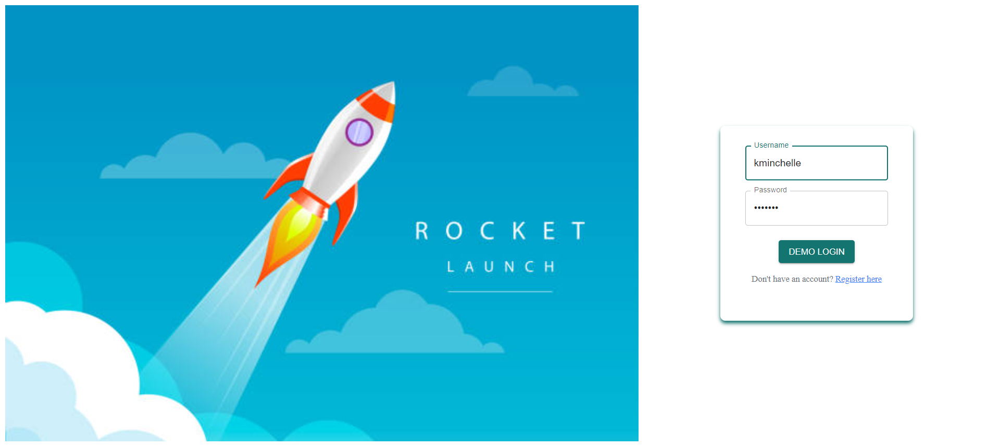
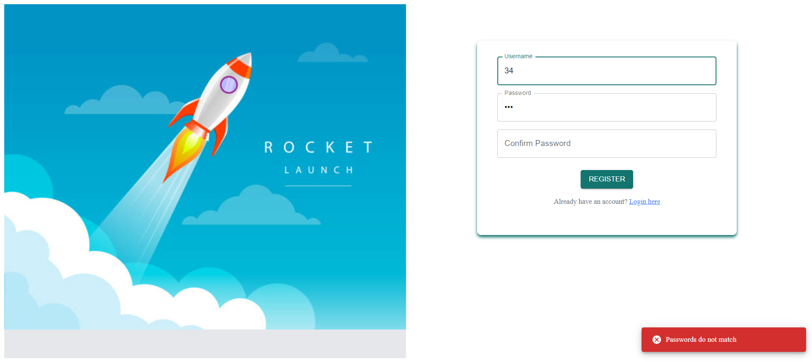
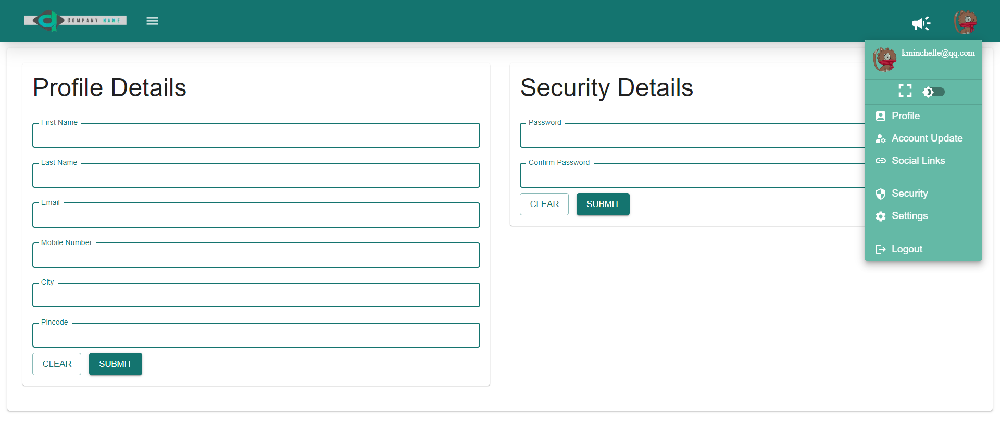
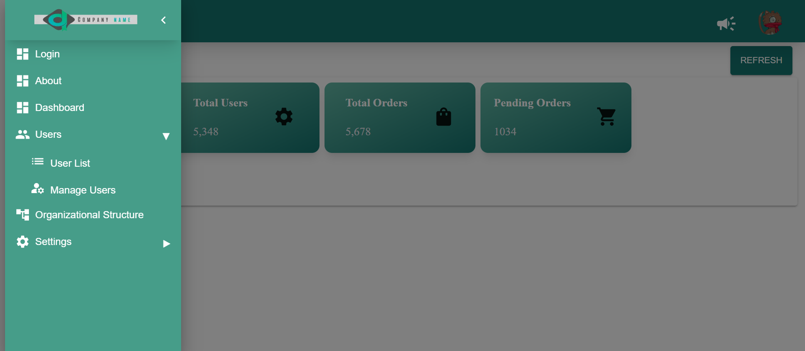
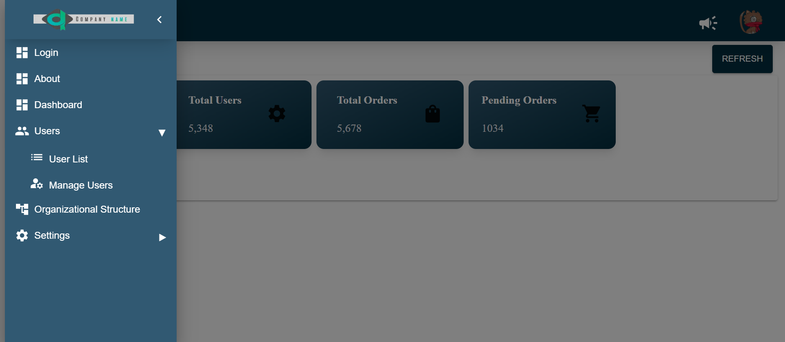
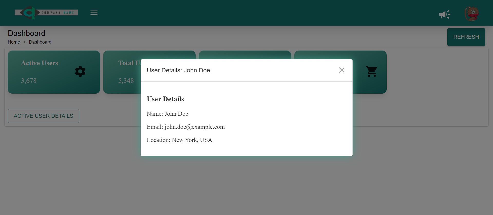
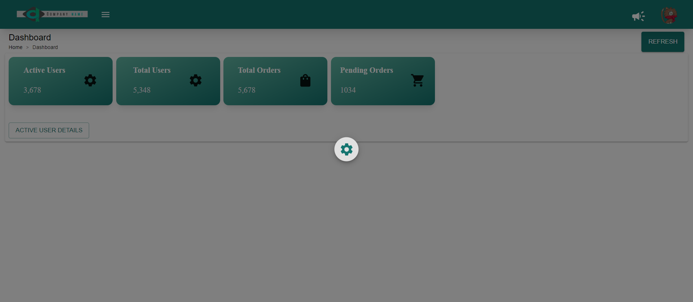

# Quick Start: Dashboard Admin Template

## TECH STACK

```bash
NEXT JS
REACT JS
Tailwind CSS
Material-UI
Axios
React Hook Form
Styled-components
Yup
```

This is a streamlined admin portal equipped with a sidebar and various pages/components. It includes token and REST API setup, along with theme customization and notification functionalities. Additionally, it features cookie management for seamless navigation. This setup is designed to accelerate the implementation of business logic, bypassing the need for a rudimentary configuration

## Installation

Instructions on how to install your project.

```bash
clone dir
install npm
npm run dev
visit http://localhost:3000/
```

### Usage

Access the project by navigating to http://localhost:3000/ in your web browser and follow the provided instructions for seamless usage.

## Screenshots









## License

© 2024 SEED PRO Developers are not responsible for any sudden outbreaks of spontaneous dancing, uncontrollable laughter, or moments of extreme productivity while using this project. Proceed with caution and enjoy the ride! 🤣🚀
